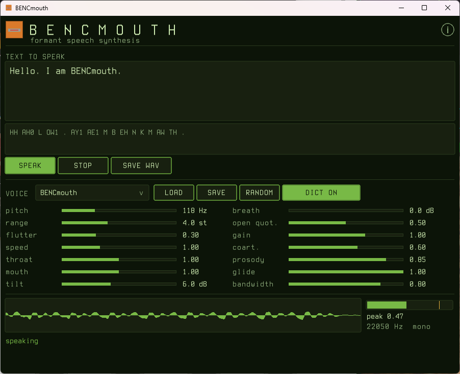

<p align="center">
  
</p>

# BENCmouth

[](https://github.com/bropple/BENCmouth/actions/workflows/ci.yml)
[](LICENSE)

A formant speech synthesizer in C99. Text goes in, speech comes out.

It is an original work in the spirit of S.A.M. (Software Automatic Mouth) — not a port,
a decompilation, or a transliteration of it. The synthesis is built from the published
literature on cascade/parallel formant synthesis; the letter-to-sound rules come from a
public-domain 1976 US Naval Research Laboratory report. See `ref/README.md` for the full
provenance.

**No dynamic allocation. No libm in the core. No I/O below the host layer.** The engine
holds about 15 KB of state in caller-supplied storage, which means it drops into a
microcontroller, an audio callback, or a WASM module unchanged.



**[Download a build](https://github.com/bropple/BENCmouth/releases/latest)** for Linux,
macOS, Windows or the browser — or `make` it, which takes about two seconds.

---

## Quick start

```
make
./bm "Hello world" -o hello.wav
```

That is the whole thing. No configure step, no dependencies beyond a C compiler and the
system maths library.

---

## Building

The build is a plain GNU makefile with no external dependencies. Every platform below
produces the same `bm` executable plus `libbencmouth.a`.

### Linux

```
sudo apt install build-essential      # Debian/Ubuntu
sudo pacman -S base-devel             # Arch
sudo dnf groupinstall "Development Tools"   # Fedora

make
```

### macOS

```
xcode-select --install    # if you have not already
make
```

Apple's `make` is GNU make and `cc` is clang; both work as-is. If you prefer Homebrew GCC,
`make CC=gcc-14` also works.

### Windows

The makefile needs GNU make, so use one of:

**MSYS2 / MinGW-w64 (recommended)**

```
pacman -S mingw-w64-ucrt-x86_64-gcc make
mingw32-make
```

Run from the *UCRT64* shell, not the MSYS shell, so you get a native Windows binary
rather than one linked against the MSYS runtime.

**MSVC**, without make — the source list is short enough to compile directly. From a
*Developer Command Prompt*:

```
cl /std:c11 /O2 /Iinclude /Isrc\core /Isrc\host /Fe:bm.exe ^
   src\core\*.c src\host\*.c
```

MSVC needs `/std:c11` (or `/std:c17`) rather than a C99 flag; its C99 mode is not
selectable and the default is too old for `stdint.h` usage in the public header.

> **These are verified, not assumed.** CI builds and runs the full test suite on
> `ubuntu-latest`, `macos-latest` and `windows-latest` (MSYS2/UCRT64) on every push, plus a
> strict pass with `-Werror` and one under AddressSanitizer and UBSan. If a documented
> build path breaks, that is a bug rather than a limitation.

### Make targets

| Target | Result |
|---|---|
| `make` | library, `bm`, and both demos |
| `make lib` | `libbencmouth.a` only |
| `make bm` | the CLI only |
| `make audio` | compile live playback in and rebuild |
| `make wasm` | build `bencmouth.wasm` (needs clang and lld) |
| `make gui` | build the desktop GUI (needs raylib) |
| `make dict` | compile CMUdict in and rebuild (see below) |
| `make test` | run all eight test suites |
| `make check-freestanding` | assert the core includes no hosted headers |
| `make clean` | remove build products |

---

## Using the CLI

```
bm [options] "text to speak"

  -o FILE      write WAV here (default out.wav; - for stdout)
  -v NAME      use a voice preset
  -f FILE      load a voice file
  -R SEED      generate a random voice from SEED
  -s SPEED     speech rate; 1.0 nominal, 2.0 twice as fast
  -p PITCH     base pitch in Hz
  -P           input is ARPABET phonemes, not text
  -m           enable inline markup
  -t           print phonemes and exit; render nothing
  -w FILE      write the resolved voice to a voice file and exit
  -l           list voice presets
  -r RATE      sample rate (default 22050)
  -h           help
```

```
bm "Hello world" -o hello.wav
bm -v retro -s 0.8 "I am sorry Dave" -o dave.wav
bm -P "HH AH0 L OW1" -o hello.wav          # phonemes directly
bm -t "the quick brown fox"                # see what the rules produced
bm -f voices/gravel.voice "testing" -o t.wav
```

### Inline markup

Off unless you ask for it with `-m`, because with it off `[pitch 70]` is ordinary text
and gets spoken as the words "pitch seventy" — turning brackets into commands silently
would swallow text for anyone who did not opt in.

```
bm -m "normal speed. [speed 0.7] now slower. [pitch 160] and higher."
bm -m "wait for it [pause 800] there it is"
bm -m "[pitch 70] low ... [reset] and back to normal"
```

| Command | Effect |
|---|---|
| `[pitch N]` | base pitch in Hz, 20–500, for everything after it |
| `[speed X]` | rate multiplier, 0.1–10 |
| `[pause N]` | N milliseconds of silence, inserted here (max 10000) |
| `[note NAME]` | absolute pitch by name — `C4`, `A#3`, `Bb5`, `G` |
| `[hold N]` | length in ms of the vowels that follow |
| `[reset]` | back to the voice's own settings |

`[note]` and `[hold]` are what make it sing. `[note]` is absolute where `[pitch]` is a
transposition — a sung note should be that pitch, not that pitch plus whatever accent the
prosody planner had in mind. `[hold]` applies only to vowels, because that is where a
note's duration lives; stretching the consonants turns the word into a groan.

```
bm -m -P "[note C4][hold 520] D EY1 [note A3][hold 260] Z IY0 ..." -o daisy.wav
```

Commands survive into the phoneme string rather than being resolved away, so `bm -m -t`
shows exactly what the synthesizer will act on, and `-P` input honours them too:

```
$ bm -m -t "hello [pitch 70] world"
HH EH L OW [pitch 70] W ER L D
```

A malformed command is an error, not a guess — `[pitch]`, `[wobble 3]` and an unterminated
bracket all fail loudly rather than being quietly ignored.

Compile with `-DBM_WITH_MARKUP=0` to remove the parser entirely; `-m` then does nothing and
brackets stay ordinary characters.

### Playing it immediately

```
make audio
./bm -a "straight out of the speakers"
```

`make audio` picks a backend from `uname`: **ALSA** on Linux (`-lasound`), **AudioQueue**
on macOS, **waveOut** on Windows. `bm -h` prints which one is compiled in.

Optional for the same reason the dictionary is — a plain `make` should need nothing but a
C compiler, and ALSA headers are a package a first-time builder should not have to hunt
for. Without it, `-a` says so rather than failing to build.

Playback streams straight from `bm_read()` to the device with no buffer of the whole
utterance in between, which is the pull interface doing exactly what it was shaped for.
Limiting is shared with the WAV writer, so a file is a faithful record of what you heard.

`-o -` still writes a WAV to stdout if you would rather pipe it:

```
bm "hello world" -o - | aplay              # Linux/ALSA
bm "hello world" -o - | paplay             # Linux/PulseAudio
bm "hello world" -o - > /tmp/x.wav && afplay /tmp/x.wav   # macOS
```

---

## Voices

Five presets ship in the binary:

| Voice | Character |
|---|---|
| `BENCmouth` | the default — Retro with coarticulation on |
| `BENCmouth Retro` | **the original voice, pinned** (see below) |
| `BENCmouth Monotone` | no flutter, no intonation; maximum machine |
| `Deep` | a larger speaker — longer vocal tract, not just lower pitch |
| `Bright` | a smaller speaker |

Names match loosely, so `-v retro`, `-v "BENCmouth Retro"` and `-v bencmouth-retro` all
resolve.

### Voice files

Voices are plain text and live in `voices/`:

```
# BENCmouth voice
name           = Gravel
preset         = retro      # start from a preset, then override

f0_base        = 96
f0_flutter     = 0.45
throat         = 0.88       # governs F1 - the pharyngeal cavity
mouth          = 0.94       # governs F3 and up - the oral cavity
tilt           = 9
open_quotient  = 0.58
gain           = 1.0
coarticulation = 0          # 0 = hits every target exactly, the retro sound
prosody        = 0          # 0 = the pre-bm_prosody.c pitch contour
formant_glide  = 0          # 0 = linear in Hz, 1 = geometric (as heard)
bandwidth_track= 0          # 0 = table bandwidths, 1 = scaled by formant frequency
```

Unknown keys are **errors**, not warnings — a silently dropped setting produces a voice
that mysteriously sounds wrong, which is far worse to debug than a refusal to load.

Dump any voice with `bm -v deep -w mine.voice`, edit, and load it back with `-f`.

### Finding new voices

```
bm -R 4242 "hello there"          # random, but the same every time for that seed
bm -R 4242 -w found.voice         # keep one you liked
```

The parameter space is large and mostly uninteresting, and the good corners of it turn up
by accident more often than by reasoning. Draws are deterministic from the seed, and gain
is trimmed by flutter rather than drawn at random — low-flutter voices stack peaks, and
without that roughly a third of them clipped.

### Intonation

Voices with `prosody` above 0 get phrase-level contours rather than one long decline:
each phrase starts fresh, stressed syllables get pitch accents, the phrase-final syllable
is lengthened, and the last third of a phrase moves according to how it ends.

```
$ bm -t "Hello there. Are you awake?"
HH EH L OW DH EH R . AA R Y UW AH W EY K ?
```

Punctuation becomes a boundary phoneme rather than generic silence — a question and a
statement used to both become `SIL SIL`, which discarded the only thing a contour planner
could act on. Planned pitch for that sentence, in Hz:

| ending | contour |
|---|---|
| `.` statement | rises to 133 on the stressed vowel, falls to **83** |
| `?` question | rises to **149** |
| `,` continuation | settles at **115** — unfinished, but not a question |

`f0_range` sets how far the contour swings, in semitones. `prosody` at 0 restores the
older behaviour exactly: one linear decline across the whole utterance and a flat bump on
stressed phonemes. BENCmouth Retro and Monotone sit at 0.

### The dictionary

The letter-to-sound rules handle any word, but they reproduce CMUdict's exact phonemes for
only about **28%** of its 125k entries — and they emit no stress marks at all. (That is not
a contradiction of the NRL report's "90% of running text": common words are far more
regular than the proper nouns and rare words that make up most of a dictionary.)

```
make dict
```

compiles `ref/cmudict-0.7b.txt` into the binary. The difference:

| | without | with |
|---|---|---|
| colonel | K AA L OW N EH L | **K ER1 N AH0 L** |
| Wednesday | W EH D N EH S D EY | **W EH1 N Z D IY0** |
| schedule | S K EH D UW L | **S K EH1 JH UH0 L** |
| choir | CH OY R | **K W AY1 ER0** |

Note the stress digits. The rules cannot produce them, and without them every vowel in
every sentence gets identical emphasis — a large part of why longer words are hard to make
out. The dictionary is what makes stress possible at all.

Cost: the binary goes from **107 KB to 1.8 MB**. That is why it is not the default — the
core exists to run on microcontrollers, and 1.5 MB of data is not an option there. The
rules are the embedded path.

The generated `src/core/bm_dict_data.c` is gitignored: it is 4.6 MB of C and fully
reproducible from an input that *is* committed.

### The Retro contract

`BENCmouth Retro` is the original voice and it does not drift. Every naturalness
improvement arrives as a voice parameter whose *off* setting reproduces the older, cruder
behaviour, and Retro leaves them off. A feature that cannot be switched off is a feature
that has silently taken the retro voice away.

`tests/test_voices.c` enforces this with a golden reference. See `ARCHITECTURE.md`.

---

## Using the library

The public API is `include/bencmouth.h` — one header, freestanding-safe, no I/O.

```c
#include "bencmouth.h"

bm_engine_storage storage;      /* stack, .bss, a pool - your choice */
bm_engine        *engine;
bm_config         config;
float             buf[1024];

bm_config_default(&config);
bm_engine_init(&storage, &config, &engine);
bm_speak_text(engine, "hello world", 0);

while (bm_is_speaking(engine)) {
    size_t n = bm_read(engine, buf, 1024);
    /* hand buf to your audio device */
}
```

`bm_read()` is a pull interface on purpose: every real audio API is "here is a buffer,
fill it now, don't block", and this satisfies that with no ring buffer and no thread. It
never allocates and never blocks, so it is safe to call from an audio callback.

Link against `libbencmouth.a` and `-lm` (the maths library is only needed by the host
layer; the core has its own).

### Embedded builds

Compile only `src/core/*.c`. It includes no `<stdio.h>`, `<stdlib.h>`, `<math.h>` or
`<string.h>` anywhere — `make check-freestanding` asserts that, and it is worth running in
CI because the microcontroller build is what breaks first if it stops being true.

Tunables, all overridable with `-D`:

| Macro | Default | Effect |
|---|---|---|
| `BM_MAX_PHONEMES` | 512 | phonemes buffered per utterance |
| `BM_MAX_TEXT` | 1024 | bytes of text buffered |
| `BM_NFORMANTS` | 5 | drop to 3 below ~10 kHz output |
| `BM_SAMPLE_FLOAT` | 1 | set 0 for `int16_t` output |
| `BM_FIXED_POINT` | 0 | set 1 for a Q18 integer sample loop (no FPU needed) |
| `BM_WITH_MARKUP` | 1 | set 0 to drop the inline-markup parser |
| `BM_WITH_DICT` | 0 | set 1 (via `make dict`) to compile CMUdict in |
| `BM_ENGINE_RESERVED` | 65536 | storage union size; actual use is ~8.5 KB |

---

## Repository layout

```
include/bencmouth.h   the entire public API
src/core/             no stdio, no stdlib, no malloc, no libm
src/host/             platform glue - CLI, WAV writer, voice files
tools/                generators and demos (see ARCHITECTURE.md)
tests/                five suites, run with `make test`
voices/               shareable voice files
ref/                  source material and its provenance - read ref/README.md
render/               generated audio; gitignored
```

`ARCHITECTURE.md` covers the signal path and the design decisions worth defending.
`ROADMAP.md` covers what is done and what is not.

---

## Prebuilt binaries

**[Releases](https://github.com/bropple/BENCmouth/releases)** carry tagged builds for
Linux, macOS, Windows and the browser, each with live audio and CMUdict compiled in.

There are two archives per desktop platform. `bencmouth-VERSION-PLATFORM` is the CLI
alone — a console program, so on Windows double-clicking it prints usage and closes,
which is what console programs do. `bencmouth-gui-VERSION-PLATFORM` is the windowed
application, with the font it needs beside it; that is the one to double-click.

Every push also builds on all three platforms and attaches the result to its
[workflow run](https://github.com/bropple/BENCmouth/actions/workflows/ci.yml) — useful
for testing an unreleased commit, but those expire after 90 days.

---

## License

MIT — see `LICENSE`. Do what you like with it; keep the copyright notice. That is the only
condition, and it is there because Ben thought of it.

The repository also contains third-party material with its own terms, listed in `NOTICE`:
the CMU Pronouncing Dictionary is 2-clause BSD and its notice must be reproduced in binary
redistributions, the NRL letter-to-sound rules are US federal government work and therefore
public domain, and the GUI bundles Terminus (TTF) under the SIL Open Font License. If you redistribute BENCmouth in any form, ship `NOTICE` alongside
it and you have covered both.

---

## Status

Working: the synthesizer, the phoneme inventory, frame interpolation, the text front end,
voices, phrase-level prosody, inline markup, the optional dictionary, live audio output,
and the CLI.

### In a browser

```
make wasm
```

produces a bare `wasm32` module — no libc, no Emscripten runtime, nothing generated. That
works only because the core is freestanding, which is what `make check-freestanding` has
been protecting all along.

```js
import BENCmouth from './src/wasm/bencmouth.js';

const bm = await BENCmouth.load('bencmouth.wasm');
console.log(bm.phonemes('hello world'));   // HH EH L OW W ER L D
await bm.play('hello world');              // through Web Audio
const pcm = bm.say('hello world');         // or just the Float32Array
```

`bm.voice(name)` and `bm.param(key, value)` reach the presets and the `.voice` file keys.

### The GUI

```
make gui-dict     # the GUI, with the CMU dictionary compiled in
make gui          # without it - smaller, letter-to-sound rules only
./bencmouth-gui              # optionally: ./bencmouth-gui 1400x760
```

`make gui` and `make gui-dict` differ in one thing that you can hear. Without the
dictionary every word goes through the letter-to-sound rules, which get *robot* as
`R AA B AA T` — two flat vowels, no stress. With it, `R OW1 B AA2 T`. The DICT button
switches between the two at runtime so you can hear the difference on any word, which
is also how you find the ones worth adding to the exception list; it greys out in a
build that has no dictionary to switch to. The status line says which build you have.

Type, and the phoneme readout under the field updates as you go. Both panels wrap and
scroll — mouse wheel or the bar on the right — so a paragraph is as workable as a
sentence. The text box is a real text box: click to put the caret anywhere, drag or
shift-arrow to select, Ctrl-A/C/X/V (Cmd on macOS), Ctrl-arrow by word, Home and End,
and a right-click menu for the same. The phoneme readout follows the DICT button, so
what you see is what SPEAK will say. Every slider is bound to a `.voice` file key, so
what you tune and what SAVE writes cannot drift apart, and LOAD reads the same files
back — the presets in `voices/`, or anything you saved. A file is applied over the
current voice, the way `bm -f` does, so one that sets two keys is an edit rather than a
whole voice; it is parsed into a copy first, so a file that fails halfway cannot leave
you with a half-changed voice. Audio streams from `bm_read()`
into the audio callback, so moving a slider mid-sentence is audible immediately.

LOAD, SAVE and SAVE WAV ask where the file goes or comes from, through whatever dialog
the system already has: the standard Windows save dialog, the Cocoa save panel on macOS, and
zenity or kdialog on Unix. Nothing is bundled to do it — those are all either part of
the OS or already installed. On a bare X session with neither helper the file goes to
the working directory and the status line says where; that beats refusing to save over
a missing helper program.

raylib is the only third-party dependency in the project and it is confined to
`src/gui/` — `make`, `make test` and `make check-freestanding` all work without it.

On macOS the GUI ships as a disk image: mount `bencmouth-gui-VERSION-macos-arm64.dmg`
and drag BENCmouth to Applications. Inside it is `BENCmouth.app`, which is not packaging
taste — a bundle is the only way a macOS program gets an icon. Windows reads the icon from a resource inside the
executable and X11 takes it from a property the binary sets at startup, but GLFW's Cocoa
backend ignores `glfwSetWindowIcon` entirely, because a bare Mach-O executable has no
Finder or Dock identity to hang one on. The bundle is a wrapper: `Contents/MacOS` holds
a single file, because everything else is already inside it.

macOS binaries here are unsigned, so Gatekeeper will refuse them on first launch. Either
right-click the app and choose Open, or clear the quarantine flag the browser attached:

```
xattr -dr com.apple.quarantine BENCmouth.app     # or ./bm
```

The GUI executable is self-contained: the font, the window icon, the BENCO wordmark and
the licence texts are all compiled into it. A file beside an executable is a file that
can go missing — unzip without the assets folder, make a shortcut, launch from a
terminal somewhere else, and the window came up in a fallback font with no icon. Drop
`bencmouth-gui` anywhere and it looks the way it is supposed to.

The font is Terminus (TTF), embedded unmodified — the licence reserves its name against
modified versions, so it is never subset or regenerated. It is a bitmap design, so it is
loaded at three native sizes with point filtering rather than scaled: crisp unantialiased
text at fixed sizes *is* the terminal look, arrived at honestly rather than simulated. A
copy on disk beside the binary still wins, so a different build of the face can be
dropped in without recompiling; the status line says which one loaded.

Embedding the font is what the OFL allows *provided* every copy carries the copyright
notice and the licence somewhere the user can easily view them. The ⓘ button in the top
right opens a window with the program's name, copyright, the MIT licence, every
third-party notice and the full OFL text — all read out of the binary. That window is
the compliance, not a nicety.

For a target without an FPU, `-DBM_FIXED_POINT=1` runs the sample loop in Q18 integer
arithmetic — 52.9 dB SNR against the float reference, measured on a rendered sentence.
Coefficients still come from float maths at the frame rate, where it costs nothing.
